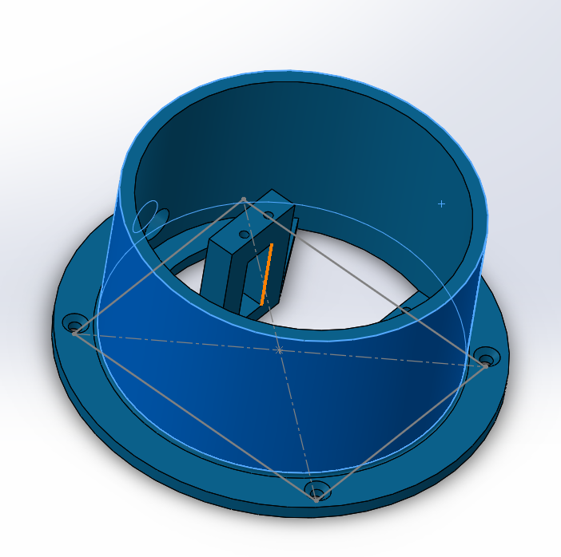

# Farming-Robot-VLNs-team
This repository has a documentation for our participation in WRO Syria 2024 (Future Innovators Category) where we implemented a farming robot that has many programming, Design, Developement tasks.
# VLNs Robotic Project: Sustainable Farming with Earth's Trusted Ally
===========================================================

## Table of Contents
- [Introduction](#introduction)
- [Project Overview](#project-overview)
- [Features](#features)
- [Technologies Used](#technologies-used)
- [Installation and Setup](#installation-and-setup)
- [Usage](#usage)
- [Troubleshooting](#troubleshooting)
- [Contributing](#contributing)
- [License](#license)
- [References](#references)

---

## Introduction
The VLNs team presents an innovative robotic solution designed to revolutionize sustainable agriculture. Our project, themed "Earth Allies," aims to create a robot that nurtures and cares for plants in an environmentally friendly manner. By leveraging renewable energy sources and advanced robotics, we envision a future where technology harmonizes with nature to enhance agricultural practices.

---

## Project Overview

### Mission
Our mission is to promote sustainable farming practices by automating critical planting and maintenance tasks. This automation not only saves time and labor but also ensures that plants receive optimal care, contributing to a greener planet.

### Robot Capabilities
- **Planting**: The robot can plant seeds with precision.
- **Watering**: It waters plants based on real-time soil moisture levels.
- **Fertilizing**: The robot applies fertilizer as needed.
- **Fruit Picking**: Automated fruit picking with high precision.
- **Monitoring**: Real-time monitoring of water and battery levels via a mobile app.

### Special Features
- **Renewable Energy**: Powered by solar panels and a Peltier module for water collection.
- **User-Friendly App**: A companion app provides real-time updates and control.

---

## Features

- **Robotic Arm**: A four-degree-of-freedom arm for precise movements.
- **Camera Calibration**: Uses OpenCV for accurate 3D reconstruction.
- **Denavit-Hartenberg Method**: For precise joint angle calculations.
- **Power Management**: Efficient use of renewable energy with a BMS chip.
- **Sustainable Design**: Compact and environmentally friendly.

---

## Technologies Used

- **Raspberry Pi 4**: For processing and data analysis.
- **Arduino Mega 2560**: Controls motors and sensors.
- **Raspberry Pi Camera**: For visual input and navigation.
- **Solar Panels**: Primary power source.
- **Peltier Module**: For water collection.
- **OpenCV**: For image processing and object detection.
- **Python**: Main programming language.
- **Arduino C**: For microcontroller programming.

---

## Installation and Setup

### Prerequisites
- Raspberry Pi 4
- Arduino Mega 2560
- Raspberry Pi Camera
- Solar Panels
- Peltier Module
- Servo Motors (MG996R, SG90)
- Water Pump
- HC-SR05 Ultrasonic Sensor
- 8-Channel Relay Module

### Setup Steps

1. **Hardware Assembly**:
   - Assemble the robotic arm and attach it to the robot's frame, the parts images:
   
   
   
   
   
   
   
   

   - Install the Raspberry Pi and Arduino boards.
   - Connect all sensors and motors according to the circuit diagram.

2. **Software Installation**:
   - Install Python and necessary libraries (OpenCV, numpy) on the Raspberry Pi.
   - Upload the Arduino code to the Arduino Mega board.

3. **Camera Calibration**:
   - Capture multiple images of a chessboard pattern using the Raspberry Pi camera.
   - Use OpenCV to estimate camera parameters.

4. **App Setup**:
   - Develop and install the mobile app using MIT App Inventor.
   - Ensure real-time data synchronization with the robot.

---

## Usage

1. **Power On**: Start the robot and ensure it is connected to the solar panel for power.
2. **Task Selection**: Use the mobile app to select tasks such as planting, watering, or fertilizing.
3. **Real-Time Monitoring**: Monitor the robot's status and resource levels via the app.

---

## Troubleshooting

- **Power Issues**: Check the solar panel's alignment and ensure the batteries are fully charged.
- **Mechanical Issues**: Inspect the robotic arm for any mechanical blockages or misalignments.
- **Software Issues**: Review the code for any logical errors or syntax mistakes.

---

## Contributing

We welcome contributions from the community! Please read our contribution guidelines before submitting a pull request.

1. **Fork the Repository**: Create a fork of this project.
2. **Create a Branch**: Make changes in a new branch.
3. **Commit Changes**: Commit your changes with a descriptive message.
4. **Push and Pull Request**: Push your changes and create a pull request.

---

## License

This project is licensed under the [MIT License](https://opensource.org/licenses/MIT).

---

## References

- [OpenCV Documentation](https://docs.opencv.org/4.x/)
- [Raspberry Pi Documentation](https://www.raspberrypi.com/documentation/)
- [Arduino Documentation](https://docs.arduino.cc/)

---

### Project Evolution

The development of our project idea evolved significantly through several distinct phases:

1. **Initial Conceptualization**: The journey began with creating a robot for assisting in agricultural tasks, primarily focusing on planting seeds. This concept expanded to include watering and fertilizing, envisioning a comprehensive solution for plant care.

2. **Integration of Renewable Energy**: We incorporated solar panels and a Peltier module to align with the "Earth Allies" theme, emphasizing environmental sustainability.

3. **Enhancement of Robotic Capabilities**: The idea of integrating a robotic arm emerged, allowing the robot to perform tasks with precision and flexibility.

4. **Incorporation of Monitoring and Control Systems**: A Raspberry Pi camera and processor were added for visual input and navigation. A mobile app was developed for real-time monitoring and control.

5. **User-Centric Design and Refinement**: The final phase focused on making the robot user-friendly through iterative design and user feedback sessions.

---

### Robot Construction

The robot's construction involves several key components and systems, each meticulously designed and integrated to ensure optimal functionality and efficiency. This includes a compact structure housing electronic components, a robotic arm for precise movements, and renewable energy sources for power.

---

### Social Impact and Innovation

Our plant-nurturing robot promises significant positive impacts both locally and globally. By leveraging renewable energy sources and advanced robotics, our solution addresses critical issues in sustainable agriculture and resource management. However, it is also essential to consider and mitigate potential negative effects that may arise from the implementation of this technology.

---

### Business Model Canvas

Our business model involves partnerships with renewable energy suppliers, environmental NGOs, and agricultural organizations. Key activities include designing and developing the robot, sourcing sustainable components, and marketing to raise awareness. The robot offers value propositions such as automated planting and watering, sustainable operation, and enhanced plant health. Customer segments include home gardeners, small-scale farmers, and environmental organizations.

---

### Sustainable Development Goals

Our project aligns with several Sustainable Development Goals, including Zero Hunger, Clean Water and Sanitation, Affordable and Clean Energy, Responsible Consumption and Production, Climate Action, and Life on Land.

---

### Next Steps

We are aiming to develop our robot to perform soil tillage and interact with the surrounding environment. We will also focus on motion and path planning to optimize energy efficiency, aligning with sustainability goals.

---

### Acknowledgments

We acknowledge the contributions of our team members and coach, who have been instrumental in the development and success of this project.

---

### Contact Us

For more information or to collaborate on this project, please contact us at [Salman Daher](mailto:salmandaher121@gmial.com).